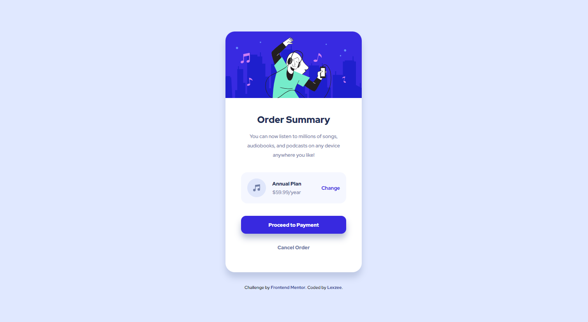

# Frontend Mentor - Order summary card solution

This is a solution to the [Order summary card challenge on Frontend Mentor](https://www.frontendmentor.io/challenges/order-summary-component-QlPmajDUj). Frontend Mentor challenges help you improve your coding skills by building realistic projects.

## Table of contents

- [Overview](#overview)
  - [The challenge](#the-challenge)
  - [Screenshot](#screenshot)
  - [Links](#links)
- [My process](#my-process)
  - [Built with](#built-with)
- [Author](#author)

## Overview

### The challenge

Users should be able to:

- See hover states for interactive elements

### Screenshot

### Links

- Solution URL: [Check the solution](https://www.frontendmentor.io/solutions/order-summary-component-w_zexnA3l6)
- Live Site URL: [Visit Live site](https://order-summary-comp-lexzee.vercel.app/)

## My process

### Built with

- Flexbox
- CSS Grid
- Mobile-first workflow
- [React](https://reactjs.org/) - JS library

## Author

- Website - [Abdulrahman Abdulquddus (Lexzee)](https://www.your-site.com)
- Frontend Mentor - [Lexzee](https://www.frontendmentor.io/profile/lexzee)
- Twitter - [DevLexzee](https://www.twitter.com/devlexzee)
